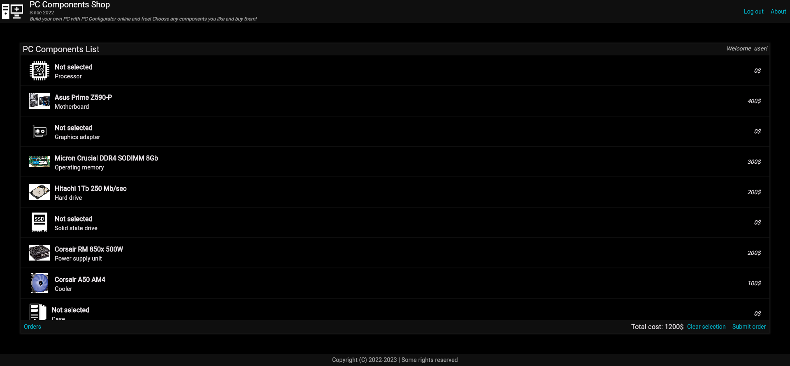
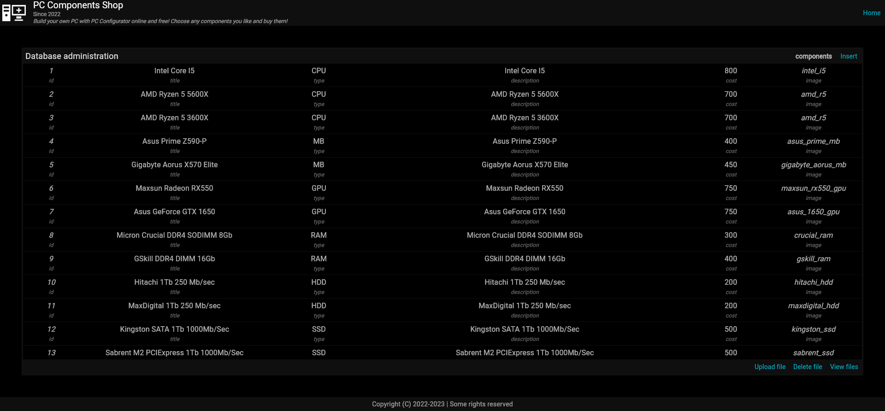
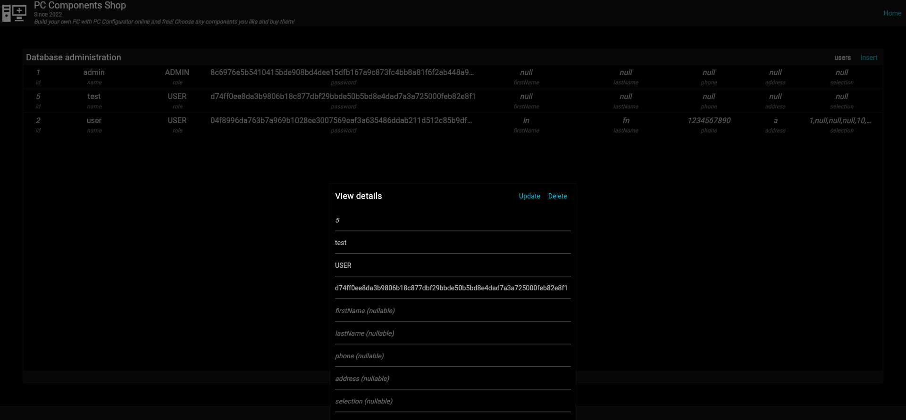

# Computer components web-application 2

```
      :::::::: :::    ::::::::::::  ::::::::  :::::::: :::     ::: :::::::: 
    :+:    :+::+:    :+::+:    :+::+:    :+::+:    :+::+:     :+::+:    :+: 
   +:+       +:+    +:++:+    +:++:+       +:+    +:++:+     +:+      +:+   
  +#+       +#+    +:++#++:++#: +#++:++#+++#+    +:++#+     +:+    +#+      
 +#+       +#+    +#++#+    +#+       +#++#+    +#+ +#+   +#+   +#+         
#+#    #+##+#    #+##+#    #+##+#    #+##+#    #+#  #+#+#+#   #+#           
########  ######## ###    ### ########  ########     ###    ##########      
```

This is a next generation of my [previous Computer components web-application](https://github.com/vadniks/ComputerComponentsWebApp).
This one is consists of two separated parts: [the back-end](https://github.com/vadniks/ComputerComponentsWebApp2_back)
and the [front-end](https://github.com/vadniks/ComputerComponentsWebApp2_front).
The back-end is written in Kotlin language using the [Ktor](https://ktor.io) framework 
which is used for developing server applications. 
The front-end is written in Dart language, and it uses the [Flutter](https://flutter.dev) framework.
Flutter is a very powerful framework for developing multi-platform applications. In this project 
it's basically used for creating UI.

## Features

- Native dark theme
- PC configurator
- Catalogue browser
- Configuration saver and price totalizer
- Database administration
- Logging in, out and registration
- User sessions via encrypted cookies

## Screenshots










## Build

The front-end part can be build with this command: 
```sh
flutter build web --web-renderer canvaskit --base-href / --dart2js-optimization O4
```
Generated files must be placed into the ```src/main/resources/static``` folder.

The back-end part can be built using this command: 
```sh
gradlew buildFatJar
```

Gradle will create two jar files. To be able running this app in the Docker-container
the ```cursov_back-all.jar``` must be placed in the same folder where the ```docker-compose.yml```
and the ```Dockerfile``` are.

## Installation

This application requires Docker and docker-compose to run.
App uses port 8080 and 5432.

This command will build and run both the server and the database containers: 
```sh
docker-compose run --build
```
after these procedures the application will be available at:
```http://localhost:8080``` in any browser, if the launch fails 
first time restart the container, this happens because there's no 
existing docker volume of the database, which is created on the 
first launch. To stop the app just send the interruption signal by
holding Ctrl and pressing C, execute this command to
remove its containers:
```sh
docker-compose down
```